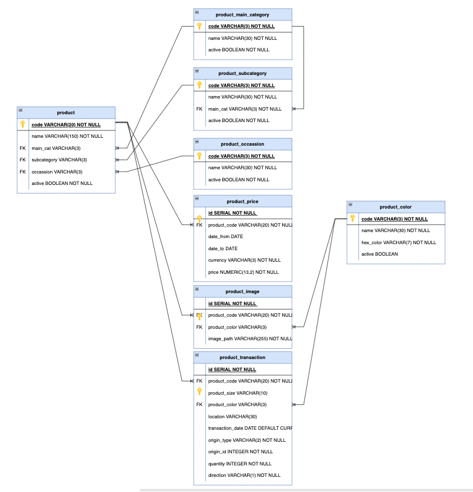

# eCommerce-Clone-Server

This repository should run concurrently with the fronend application. You may refer to the frontend repository here:
https://github.com/DaphneGoh89/eCommerce-Clone.git

## Technologies

1. ExpressJS
2. Postgresql: an SQL database used for storing application data
3. Node JS

## Schema

